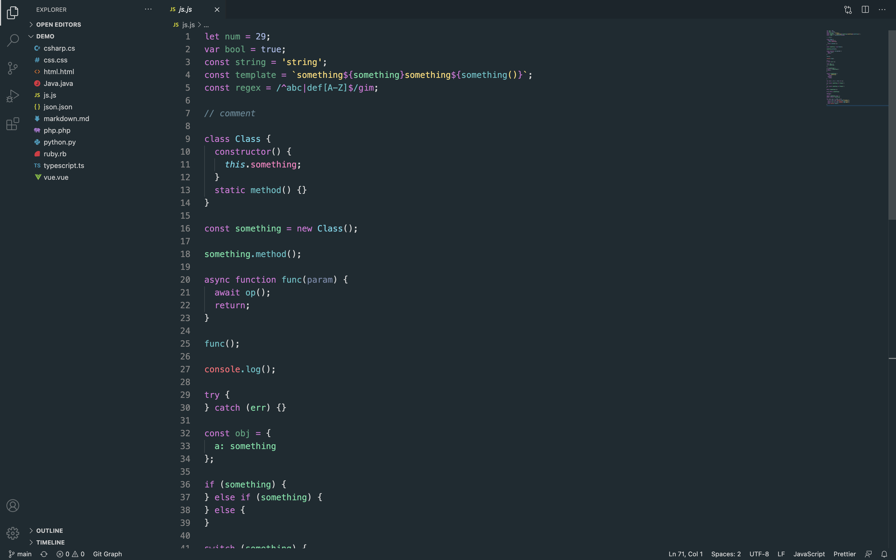

# Monet Theme For Visual Studio Code

A dark theme based on Claude Monet's Water Lilies series.

## Installation

1. Open **Extensions** through `View → Extensions`
2. Search for `Monet Theme`
3. Click **Install**
4. Click **Reload**
5. Select **Preferences > Color Theme > Monet Theme**
